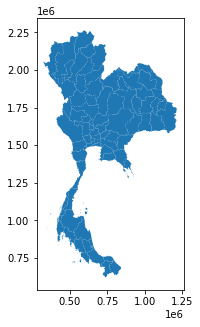

# Spatial-Data-Management-with-GeoPandas-Case-Study-in-Thailand

## Install Geopandas package

### pip
```
pip install geopandas
```

### conda
```
conda install python=3 geopandas
```

## Set up packages

```
import os
import matplotlib.pyplot as plt
import seaborn as sns

from shapely.geometry import Point
import pandas as pd
import geopandas as gpd

from geopandas import GeoSeries
from geopandas import GeoDataFrame

import requests
import geojson
```
## Read Shapefile
### Thailand provinces Shapefile

```
os.getcwd()
province = gpd.read_file('/TH_Province.shp')
```

## Plot Shapefile
```
province.plot(figsize = (6,5));
```
<!-- -->

## Shapefile Information
### First three lines
```
province.head(3)
```

### First Row
```
province.iloc[0]
```

### First Column
```
province.iloc[:,0]
```

### List all column names
```
list(province.columns) 
```

### Columns Names
```
province.columns
```

## First Column Name
```
province.columns[0]
```
### coordinate reference system
```
province.crs
```

### Calculate boundary of polygon
```
province.geometry.bounds
```

### Calculate Area
```
province.geometry.area
```